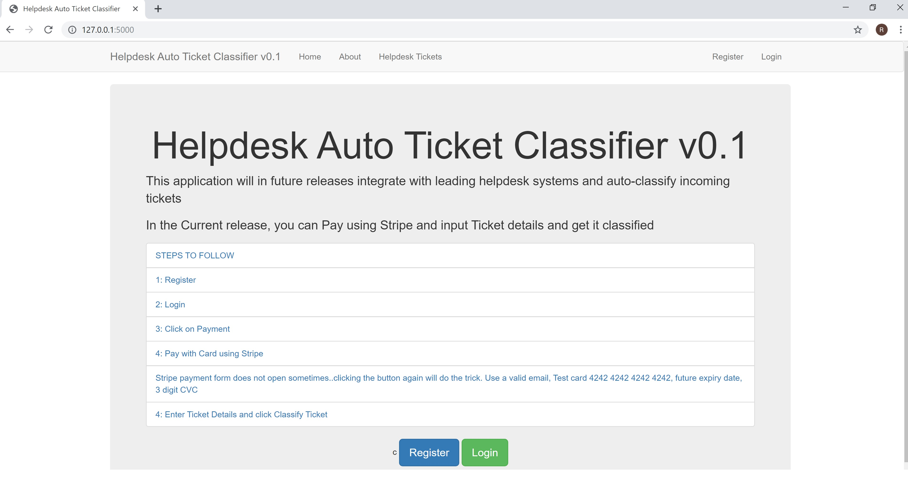
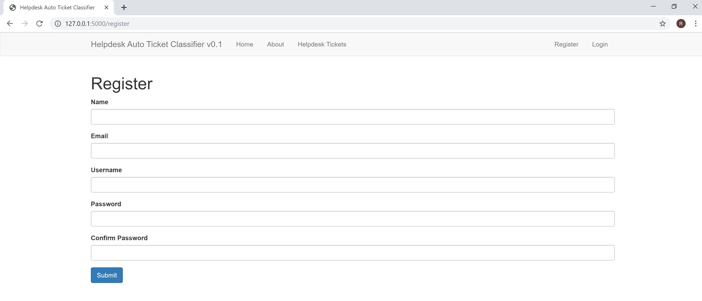
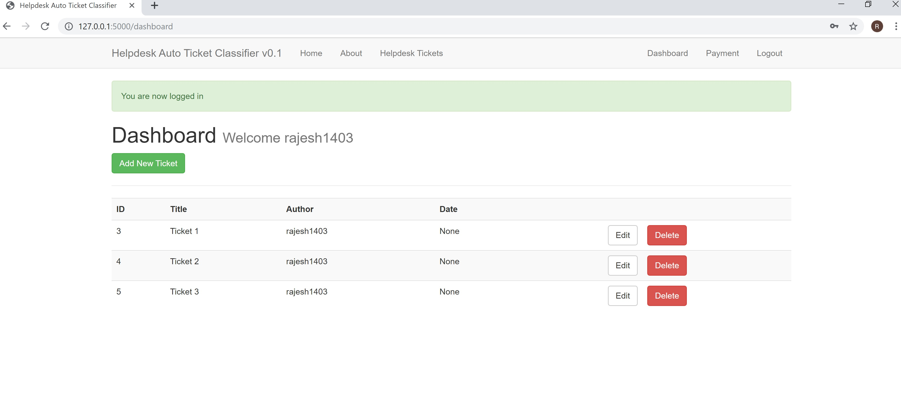
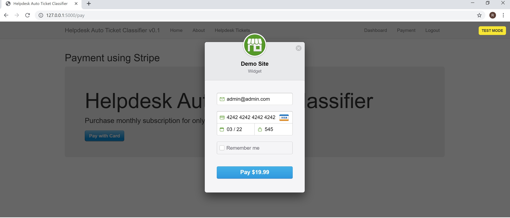
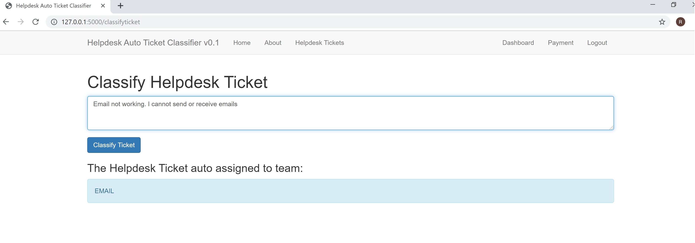
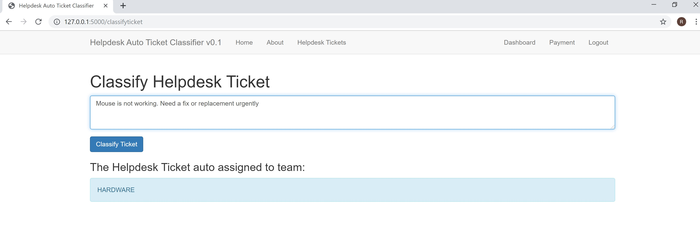
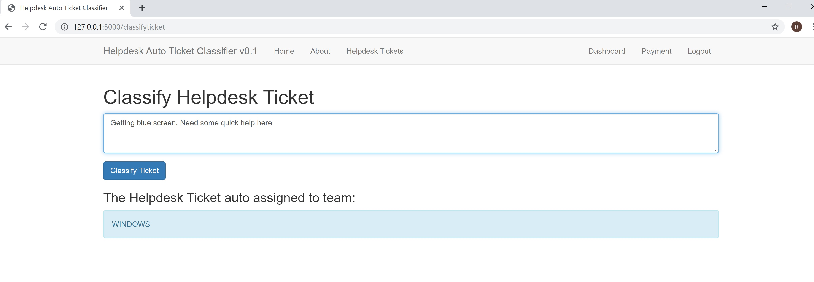

# Helpdesk Auto Ticket Classifier App

This is V0.1 of the App.
Currently hosted on local machine. Plan to host it on Heroku or alternate provider soon. 

Current release supports
- Flask app using MySQL DB as the backend
- Integration with Stripe to enable Card payments
- Inference (Ticket Classification) using saved pickle model
- Once payment is made, User can input Ticket Details and Classify ticket and assign to respective group
- The Ticket Categories are
  {0: 'ACCESS',
  1: 'HARDWARE',
  2: 'SOFTWARE',
  3: 'WINDOWS',
  4: 'EMAIL',
  5: 'ANTIVIRUS'
  }

Future releases will integrate with leading helpdesk systems and automatically classify all incoming tickets.

## Examples of Tickets 

- Need to install Microsoft Office
- My monitor is showing lines and flickering
- I am getting blue screen. WHat should I do
- Unable to access login
- Email not working. Unable to send or receive emails
- How can I prevent virus attacks

## Screenshots

### Classification Samples

## Thanks

I referred multiple github repos and tutorials to get this working.
Thanks to all of them. Will update the key ones in the near future.
